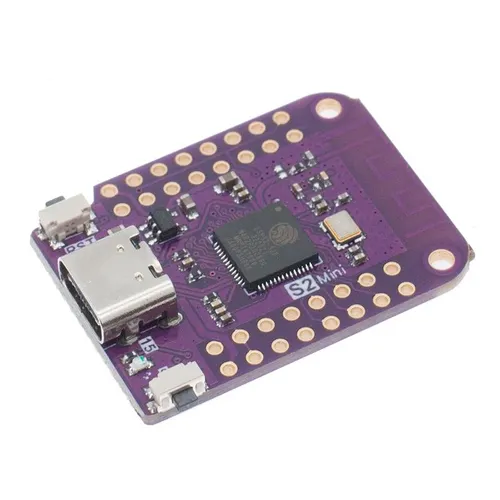

# USB Ware

<p align="center">
  
</p>

**ESP32-S2 HID Automation and Control Firmware**

---

## 1. Introduction

**USB Ware** is a modular firmware developed for the **ESP32-S2** microcontroller, designed to transform the device into a **USB Human Interface Device (HID)** capable of executing programmable keyboard and mouse automation tasks.

The firmware integrates an **embedded web server** allowing users to select and trigger multiple automation routines via a browser-based control panel.

---

## 2. System Overview

USB Ware combines **Wi-Fi access point functionality** with **USB HID capabilities**, enabling over-the-air control of keyboard automation.
The system operates by exposing a local web interface that accepts user input (feature selection) and executes corresponding USB payloads on a connected host computer.

The primary operational modules are defined within:

* `latest_release.ino` – main application logic and server control
* `Configs.h` – configuration constants and web interface HTML
* `USB_Tools.h` – USB HID operation functions and educational Python script logic

---

## 3 Web Control Interface

Upon power-up, the ESP32-S2 initializes a Wi-Fi access point (AP) under default credentials:

* **SSID:** `USB Ware`
* **Password:** `HID1000#`
* **Hidden:** `false`
* **Local IP Address:** `10.0.0.1`

Users may connect to this network and access the control dashboard through:

```
http://10.0.0.1
```

The web interface provides a structured selection form, allowing execution of predefined operational modes. A dynamic status display provides feedback regarding current activity or response.

---

## 5. Hardware Requirements

<p align="center">
  
</p>


| Component                   | Specification                                                                        |
| --------------------------- | ------------------------------------------------------------------------------------ |
| **Microcontroller**         | ESP32-S2 (native USB support required)                                               |
| **Development Environment** | Arduino IDE 1.8.19 or later                                                          |
| **Core Version**            | ESP32 Arduino Core ≥ 3.3.0                                                           |
| **Libraries**               | `WiFi.h`, `WebServer.h`, `DNSServer.h`, `USB.h`, `USBHIDKeyboard.h`, `USBHIDMouse.h` |

---

## 6. Deployment Procedure

1. Open the `latest_release.ino` file in Arduino IDE.
2. Select **Board:** *ESP32-S2 Dev Module*.
3. Upload the firmware to the device via USB.
4. Connect to the generated Wi-Fi access point (`USB Ware`).
5. Navigate to `http://10.0.0.1` in any browser.
6. Select and execute a feature from the web interface.

---

## 8. Future Enhancements

Potential extensions include:

* Local payload storage using **SPIFFS**.
* Over-The-Air (OTA) firmware updates.
* Enhanced telemetry and console output.
